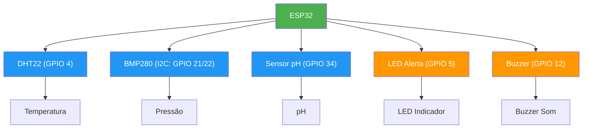

# Guia de Conexão e Pinagem - Biodigestor ESP32

## 📋 Índice

1. [Esquema de Pinos ESP32](#esquema-de-pinos-esp32)
2. [Conexão dos Sensores](#conexão-dos-sensores)
3. [Diagrama de Conexão](#diagrama-de-conexão)
4. [Tabela de Pinagem](#tabela-de-pinagem)
5. [Diagrama Elétrico Detalhado](#diagrama-elétrico-detalhado)
6. [Esquema de Alimentação](#esquema-de-alimentação)

---

## Esquema de Pinos ESP32

A placa ESP32 possui 38 pinos. Abaixo estão os principais:

```
        ┌──────────────────────────────────────────┐
        │        ESP32 DevKit Board                │
        ├──────────────────────────────────────────┤
        │                                          │
   5V ──┤ 5V                              GND ├─── GND
   3V3─┤ 3V3                             GND ├─── GND
  RST ──┤ RST                             EN  ├─── EN
  TX0 ──┤ TX0                             D23 ├─── GPIO 23 (MOSI - SPI)
  RX0 ──┤ RX0                             D22 ├─── GPIO 22 (SCL - I2C)
   12 ──┤ D12                             D21 ├─── GPIO 21 (SDA - I2C)
   13 ──┤ D13                             D20 ├─── -
   14 ──┤ D14                             D19 ├─── GPIO 19 (MISO - SPI)
   27 ──┤ D27                             D18 ├─── GPIO 18 (CLK - SPI)
   26 ──┤ D26                             D5  ├─── GPIO 5 (LED_ALERT)
    4 ──┤ D4  (DHT22)                     D17 ├─── GPIO 17
    0 ──┤ D0                              D16 ├─── GPIO 16
    2 ──┤ D2                              D10 ├─── GPIO 10
   15 ──┤ D15                             D9  ├─── GPIO 9
    8 ──┤ D8                              D11 ├─── GPIO 11
    3 ──┤ RX2                             D6  ├─── GPIO 6
    1 ──┤ TX2                             D7  ├─── GPIO 7
   32 ──┤ D32                             D8  ├─── GPIO 8
   33 ──┤ D33                             D3  ├─── GPIO 3
   34 ──┤ D34 (pH_PIN)                    CLK ├─── CLK
   35 ──┤ D35                             CMD ├─── CMD
        │                                          │
        └──────────────────────────────────────────┘
```

---

## Conexão dos Sensores

### 1️⃣ Sensor de Temperatura (DHT22)

**Configuração do DHT22:**
```
DHT22 Pinagem:
┌─────────────────┐
│ 1 2 3 4         │ (Vendo o sensor de frente)
└─────────────────┘
│ │ │ │
Pin 1: VCC (+5V ou 3.3V)
Pin 2: DATA (GPIO)
Pin 3: Não usado
Pin 4: GND
```

**Conexão com ESP32:**
```
DHT22     →    ESP32
Pin 1 (VCC) → 5V (ou 3V3)
Pin 2 (DATA) → GPIO 4 (D4)
Pin 4 (GND) → GND

⚠️ IMPORTANTE: Adicione resistor de pull-up de 10kΩ
         5V
          │
         ┌┴─────────┬───── GPIO 4
         │ 10kΩ    DHT22
         │         Pin 2
         │
        GND
```

---

### 2️⃣ Sensor de Pressão (BMP280)

**Configuração do BMP280:**
```
BMP280 (Módulo com 4 pinos):
┌──────────────┐
│ VCC GND SCL SDA │ (Pinos de cima para baixo)
└──────────────┘
```

**Conexão com ESP32 (I2C):**
```
BMP280      →    ESP32
VCC         → 3V3 (ou 5V com regulador)
GND         → GND
SCL         → GPIO 22 (D22)
SDA         → GPIO 21 (D21)

⚠️ IMPORTANTE: Adicione resistores de pull-up de 4.7kΩ
         3V3
          │
        ┌─┴──────────────┬────────── GPIO 22 (SCL)
        │ 4.7kΩ          │ 4.7kΩ
        │                │
        │             ┌──┴────────── GPIO 21 (SDA)
        │             │
       GND           GND
       
       BMP280 (I2C 0x76)
         VCC → 3V3
         GND → GND
         SCL → GPIO 22
         SDA → GPIO 21
```

---

### 3️⃣ Sensor de pH (Analógico)

**Configuração do Sensor de pH:**
```
Sensor Analógico (3 fios):
┌──────────────────┐
│ Vermelho Preto Amarelo │
└──────────────────┘
Vcc    GND    Saída Analógica
```

**Conexão com ESP32:**
```
Sensor de pH  →    ESP32
Fio Vermelho → 5V
Fio Preto    → GND
Fio Amarelo  → GPIO 34 (D34) - ADC1_CH6

⚠️ IMPORTANTE: Adicione condensador de 100nF entre ADC e GND
                    5V
                     │
              Sensor pH
                     │
                  Amarelo
                     ├────────── GPIO 34
                     │           ║
                    GND        100nF
                     │           ║
                    GND         GND
```

---

### 4️⃣ LED de Alerta

**Conexão do LED:**
```
LED (Diodo Emissor de Luz):
     ┌─────┐
     │ ▲ │
     │   │
     └──┬┘
        │ (Anodo = Mais longo)
        
LED Conexão:
Anodo (mais longo)  → GPIO 5 via resistor 330Ω
Cátodo (mais curto) → GND

        GPIO 5
           │
         ┌─┴──┐
         │ 330Ω
         │    └─────┬──── LED Anodo (mais longo)
         │          │
        GND    LED Cátodo (mais curto)
                    │
                   GND
```

---

### 5️⃣ Buzzer (Piezo)

**Conexão do Buzzer:**
```
Buzzer Piezo:
┌────────┐
│ + (Positivo)  │
│ - (Negativo)  │
└────────┘

Buzzer Conexão:
Terminal Positivo → GPIO 12 via transistor BC547 (opcional)
Terminal Negativo → GND

Circuito com Transistor (recomendado):
              5V
               │
            ┌──┴──┐
            │     │ LED (proteção)
            │     330Ω
            │     │
          GPIO12──┤ Base (BC547)
                  │
            ┌─────┤ Coletor
            │     │
       Buzzer  ┌──┤ Emissor
         +    │   │
         ├────┘  GND
         -
         │
        GND

OBS: Se usar apenas sem transistor:
GPIO 12 ──┐
          │
        [330Ω]
          │
        Buzzer
          │
         GND
```

---

## Diagrama de Conexão



---

## Tabela de Pinagem

| GPIO | Função | Tipo | Tensão | Protocolo | Observações |
|------|--------|------|--------|-----------|------------|
| 4 | DHT22 (Temperatura) | Digital | 3.3V | 1-Wire | Pull-up 10kΩ recomendado |
| 21 | BMP280 SDA | I2C | 3.3V | I2C | Pull-up 4.7kΩ |
| 22 | BMP280 SCL | I2C | 3.3V | I2C | Pull-up 4.7kΩ |
| 34 | Sensor pH | Analógico | 0-3.3V | ADC1 | Entrada apenas, sem filtro 100nF |
| 5 | LED Alerta | Digital | 3.3V | GPIO | Saída, resistor 330Ω |
| 12 | Buzzer | Digital | 3.3V | GPIO | Saída, usar transistor se necessário |
| GND | Terra Comum | - | 0V | - | Todos os GND devem estar conectados |
| 5V | Alimentação | - | 5V | - | Entrada de alimentação principal |
| 3.3V | Regulador | - | 3.3V | - | Saída do regulador interno |

---

## Diagrama Elétrico Detalhado

```
┌────────────────────────────────────────────────────────────────────┐
│                        BIODIGESTOR ESP32                            │
├────────────────────────────────────────────────────────────────────┤
│                                                                     │
│                    ┌─────────────┐                                  │
│                    │   ESP32     │                                  │
│                    └─────────────┘                                  │
│                         │                                           │
│      ┌──────────────────┼──────────────────┬─────────────────┐    │
│      │                  │                  │                 │    │
│  ┌───▼──────┐      ┌───▼──────┐      ┌───▼──────┐      ┌───▼──────┐ │
│  │  DHT22   │      │  BMP280  │      │  pH      │      │   LED    │ │
│  │GPIO 4    │      │GPIO 21/22│      │GPIO 34   │      │GPIO 5    │ │
│  └───┬──────┘      └───┬──────┘      └───┬──────┘      └───┬──────┘ │
│      │                 │                 │                 │        │
│   Temperatura      Pressão            Acidez          Indicador    │
│      │                 │                 │                 │        │
│  ┌───▼─────┐       ┌───▼─────┐      ┌───▼─────┐      ┌───▼─────┐  │
│  │ 20°C    │       │1013 hPa │      │ 7.2 pH  │      │ ▲ ▲ ▲   │  │
│  └─────────┘       └─────────┘      └─────────┘      └─────────┘  │
│                                                                     │
│  ┌──────────────────┐                  ┌──────────────────────┐  │
│  │    BUZZER        │                  │ WiFi (Integrado)     │  │
│  │    GPIO 12       │                  │ Conectado à Rede     │  │
│  └──────────────────┘                  └──────────────────────┘  │
│                                                                     │
│ Alimentação:                                                        │
│  ├─ 5V USB via Conector Micro USB                                  │
│  └─ Regulador 3.3V Interno (500mA)                               │
│                                                                     │
└────────────────────────────────────────────────────────────────────┘

FLUXO DE DADOS:
Sensores → GPIO → ESP32 → Processamento → Serial/WiFi → Armazenamento
```

---

## Esquema de Alimentação

### 🔌 Fonte de Alimentação

```
┌──────────────────┐
│   Fonte 5V USB   │
│   (2A mínimo)    │
└────────┬─────────┘
         │
    ┌────▼─────┐
    │  Cabo    │
    │ Micro USB│
    └────┬─────┘
         │
    ┌────▼──────────────────┐
    │      ESP32            │
    │  ┌────────────────┐   │
    │  │ Regulador 3.3V│   │
    │  │    (500mA)    │   │
    │  └────────────────┘   │
    └────┬─────────────┬────┘
         │             │
      5V (100mA)   3.3V (400mA)
         │             │
    ┌────▼────┐    ┌───▼───┐
    │ DHT22   │    │BMP280 │
    │Buzzer   │    │LED    │
    │pH Sensor│    └───────┘
    └─────────┘
```

### ⚡ Consumo de Energia

| Componente | Corrente | Tensão | Notas |
|-----------|----------|--------|-------|
| ESP32 | 80-200 mA | 5V | Varia com WiFi |
| DHT22 | 1-2 mA | 3.3V | Mínimo |
| BMP280 | 0.7 mA | 3.3V | Muito baixo |
| Sensor pH | 5-10 mA | 5V | Depende do modelo |
| LED | 20 mA | 3.3V | Com resistor 330Ω |
| Buzzer | 30-50 mA | 5V | Picos curtos |
| **Total** | **200-300 mA** | Misto | Repouso |

### ⚠️ Recomendações

- Usar fonte USB de **2A ou mais**
- Adicionar capacitor de **100µF** perto dos pinos 5V
- Adicionar capacitor de **10µF** perto dos pinos 3.3V
- Manter cabos curtos
- Usar cabo USB de qualidade

---

## Verificação de Conexões

### Checklist de Conexão

- [ ] ESP32 alimentado (LED verde aceso)
- [ ] Pino TX/RX conectados (se usar Serial externa)
- [ ] DHT22 conectado a GPIO 4 com pull-up
- [ ] BMP280 conectado I2C com pull-ups
- [ ] pH conectado a GPIO 34 com filtro
- [ ] LED conectado a GPIO 5 com resistor
- [ ] Buzzer conectado a GPIO 12
- [ ] Todos os GND conectados entre si
- [ ] Nenhum pino solto ou mal soldado

### Teste de Conectividade

```cpp
// Execute este código para testar
void setup() {
  Serial.begin(115200);
  
  // Teste pino digital
  pinMode(4, OUTPUT);
  digitalWrite(4, HIGH);
  Serial.println("GPIO 4 OK");
  
  // Teste I2C
  Wire.begin(21, 22);
  Serial.println("I2C GPIO 21/22 OK");
  
  // Teste entrada analógica
  analogRead(34);
  Serial.println("GPIO 34 OK");
}
```

---

## 🔧 Troubleshooting de Conexões

### Problema: "Sensor não encontrado"

**Verificação:**
1. Confirme as conexões SDA/SCL
2. Teste com Scanner I2C
3. Verifique endereço I2C (0x76 ou 0x77)

### Problema: "DHT retorna NaN"

**Verificação:**
1. Confirme pino DATA correto
2. Adicione resistor pull-up
3. Verifique alimentação

### Problema: "pH sem sinal"

**Verificação:**
1. Teste voltagem com multímetro
2. Confirme GPIO 34 (entrada analógica)
3. Verifique filtro de ruído

---

**Documento criado em:** 12 de Junho de 2026  
**Versão:** 1.0.0
