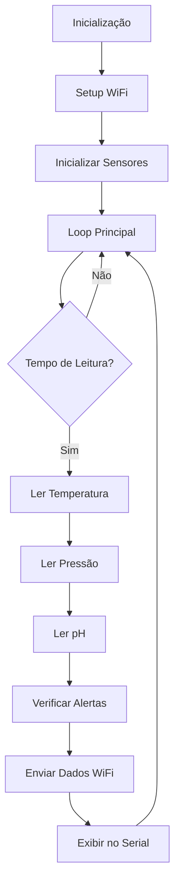

# Sistema de Automação para Biodigestor com ESP32

## 📋 Visão Geral

Este projeto implementa um sistema completo de monitoramento e automação para um biodigestor utilizando a placa **ESP32**. O sistema coleta dados de três sensores críticos acoplados dentro do biodigestor para captar dados em tempo real da produção de biogás.

---

## 🔧 Componentes de Hardware

### Sensores Utilizados

| Sensor | Tipo | Interface | Finalidade |
|--------|------|-----------|-----------|
| **Temperatura** | DHT22 ou DS18B20 | Digital/1Wire | Monitorar temperatura do processo |
| **Pressão** | BMP280/BMP180 | I2C | Medir pressão da câmara |
| **pH** | Sensor Analógico | Entrada Analógica | Monitorar acidez do substrato |
| **WiFi** | Integrado ESP32 | Rede | Comunicação e envio de dados |

### Pinagem do ESP32

```
GPIO 4  → Sensor de Temperatura (DHT22/DS18B20)
GPIO 21 → SDA (I2C - Sensor de Pressão)
GPIO 22 → SCL (I2C - Sensor de Pressão)
GPIO 34 → Entrada Analógica (Sensor de pH)
```

---

## 📦 Bibliotecas Requeridas

Instale as seguintes bibliotecas no Arduino IDE:

1. **DHT sensor library** (Adafruit) - v1.4.6+
   - `DHT sensor library by Adafruit`

2. **Adafruit Unified Sensor** - v1.1.14+
   - `Adafruit Unified Sensor by Adafruit`

3. **Adafruit BMP280 Library** - v2.6.8+
   - `Adafruit BMP280 Library by Adafruit`

4. **WiFi.h** - Integrada no ESP32

### Instalação das Bibliotecas

```
Arduino IDE → Sketch → Include Library → Manage Libraries
```

Procure por cada biblioteca e clique em "Install".

---

## 🚀 Funcionalidades Principais

### 1. **Leitura de Temperatura**
- Coleta dados do sensor a cada 10 segundos
- Armazena valores mínimo e máximo
- Alerta se temperatura estiver fora da faixa (20-60°C)

### 2. **Leitura de Pressão**
- Monitoramento contínuo da pressão da câmara
- Conversão para unidades de pressão (Pa, hPa)
- Detecção de anomalias

### 3. **Monitoramento de pH**
- Calibração do sensor de pH (2 pontos)
- Leitura contínua com filtragem
- Alertas para pH fora da faixa ideal (6.5-8.0)

### 4. **Conectividade WiFi**
- Conexão automática à rede WiFi
- Envio de dados para servidor (opcional)
- Reconexão automática em caso de desconexão

### 5. **Sistema de Alertas**
- LED indicador de status
- Buzzer para alertas críticos
- Registros em Serial Monitor

---

## 🔌 Instalação e Configuração

### Pré-requisitos

1. **Arduino IDE** instalada
2. **Suporte ESP32** adicionado ao Arduino IDE
3. Placa **ESP32 Dev Kit** ou similar
4. Cabo USB para programação

### Adicionando Suporte ESP32 no Arduino IDE

```
Arduino IDE → File → Preferences
Adicione a URL: https://raw.githubusercontent.com/espressif/arduino-esp32/gh-pages/package_esp32_index.json
Em: Additional Boards Manager URLs
```

Depois:
```
Tools → Board Manager → Procure por ESP32 → Instale
```

### Configuração Básica

1. Abra o arquivo `biodigestor_esp32.ino`
2. Edite as credenciais WiFi (linhas 18-19):
   ```cpp
   const char* ssid = "seu_SSID_aqui";
   const char* password = "sua_senha_aqui";
   ```

3. Configure o pino do sensor de temperatura (linha 21):
   ```cpp
   #define DHTPIN 4        // GPIO 4 (ajuste conforme seu projeto)
   ```

4. Carregue o código na placa:
   ```
   Tools → Port → Selecione a porta COM
   Sketch → Upload
   ```

---

## 📊 Estrutura de Dados e Variáveis

### Variáveis Globais Principais

```cpp
// Temperatura
float temperatura;           // Temperatura atual (°C)
float tempMin = 100;        // Temperatura mínima registrada
float tempMax = -40;        // Temperatura máxima registrada

// Pressão
float pressao;              // Pressão atual (hPa)
float pressaoMin = 1100;    // Pressão mínima registrada
float pressaoMax = 900;     // Pressão máxima registrada

// pH
float pH;                   // Valor de pH atual
const float pH_MIN = 6.5;   // pH mínimo ideal
const float pH_MAX = 8.0;   // pH máximo ideal

// WiFi
unsigned long lastSensorRead = 0;  // Controle de tempo
const unsigned long SENSOR_INTERVAL = 10000;  // Intervalo de leitura (ms)
```

---

## 🔄 Fluxo Principal do Programa



---

## 📡 Protocolo de Comunicação

### Serial Monitor (Debug)

O programa envia dados continuamente pela Serial a 115200 bps:

```
=== BIODIGESTOR ESP32 ===
Temperatura: 28.5°C (Min: 20.1°C | Max: 32.3°C)
Pressão: 1013.25 hPa (Min: 1010.5 hPa | Max: 1015.2 hPa)
pH: 7.2 (Ideal: 6.5-8.0)
WiFi: Conectado (IP: 192.168.1.100)
================================
```

### Endpoint HTTP (Opcional)

Para enviar dados para um servidor:

```
GET /api/biodigestor?temp=28.5&pressao=1013&ph=7.2
Host: seu_servidor.com
```

---

## ⚠️ Alertas e Condições Críticas

| Condição | Threshold | Ação |
|----------|-----------|------|
| Temperatura Baixa | < 20°C | LED Piscante + Buzzer |
| Temperatura Alta | > 60°C | LED Contínuo + Buzzer |
| pH Baixo | < 6.5 | Notificação Serial |
| pH Alto | > 8.0 | Notificação Serial |
| Pressão Anômala | > 1050 hPa | Aviso no Serial |
| WiFi Desconectado | - | Reconexão Automática |

---

## 🛠️ Troubleshooting

### Problema: Sensor de Temperatura não é detectado

**Solução:**
- Verifique a conexão do fio DATA no GPIO correto
- Teste com outro GPIO
- Reinstale a biblioteca DHT

### Problema: WiFi não conecta

**Solução:**
- Verifique SSID e senha (sensível a maiúsculas)
- Confirme que o ESP32 está a menos de 5 metros do roteador
- Reinicie o ESP32

### Problema: Leitura de pH incorreta

**Solução:**
- Calibre o sensor usando soluções de pH conhecido (4.0 e 7.0)
- Verifique o pino analógico
- Limpe o eletrodo do sensor

### Problema: Dados não aparecem no Serial

**Solução:**
- Verifique a velocidade em Baud: deve ser **115200**
- Confirme o cabo USB
- Reinstale os drivers da placa

---

## 📝 Comandos AT (Comunicação Serial)

O programa suporta comandos simples via Serial Monitor:

| Comando | Efeito |
|---------|--------|
| `R` | Reseta valores min/max |
| `S` | Mostra estatísticas |
| `C` | Reconecta WiFi |
| `T` | Testa todos os sensores |

---

## 📈 Armazenamento de Dados

### Opção 1: SPIFFS (Memória Interna)

O programa pode armazenar dados na memória flash:

```cpp
SPIFFS.begin(true);
File file = SPIFFS.open("/dados.txt", FILE_APPEND);
```

### Opção 2: MicroSD (Recomendado)

Use um módulo MicroSD para armazenamento ilimitado:

```
GPIO 5  → CS (Chip Select)
GPIO 18 → CLK
GPIO 19 → MISO
GPIO 23 → MOSI
```

### Opção 3: Nuvem

Integre com serviços como:
- **ThingSpeak**
- **Ubidots**
- **Blynk**
- **Firebase**

---

## 🔐 Segurança WiFi

### Boas Práticas

1. **Nunca commit de credenciais** - Use arquivo de configuração separado
2. **HTTPS** - Sempre que possível
3. **Token de Autenticação** - Para envio de dados
4. **Filtro MAC** - No roteador WiFi

---

## 📚 Referências e Recursos

- [Documentação ESP32 oficial](https://docs.espressif.com/projects/esp-idf/en/latest/)
- [Arduino Reference](https://www.arduino.cc/reference/en/)
- [Datasheets dos Sensores](./datasheets/)
- [Fórum Arduino](https://forum.arduino.cc/)

---

## 📄 Licença

Este projeto é disponibilizado sob licença MIT.

---

## ✉️ Suporte

Para dúvidas ou sugestões, entre em contato.

---

**Versão:** 1.0.0  
**Data:** 12 de Junho de 2026  
**Status:** Produção
